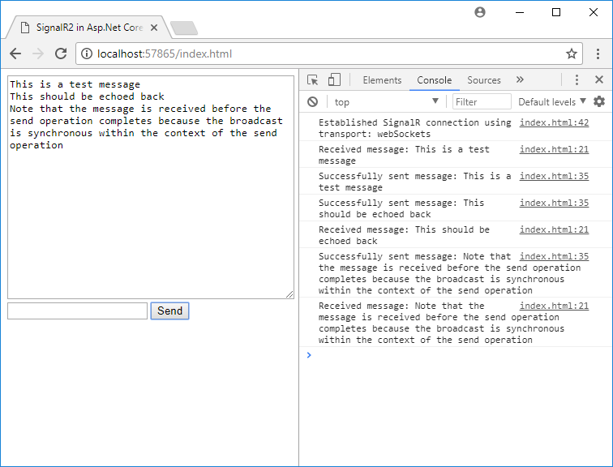

SignalR 2.2.2 Demo Using ASP.Net Core 2.0
=========================================

This demo shows how to use SignalR 2.2.2 with ASP.Net Core using all available transports.

WebSockets Support
------------------

In order to add WebSockets support, a very slightly customised version of
Microsoft.AspNet.SignalR.Core must be used so that WebSockets support can be added to the
ASP.Net Core web host instead of the Owin host that SignalR uses (so that you could add your
own WebSockets handlers using the regular ASP.Net Core method). This customisation was
originally written by [Jared Kells](https://github.com/jkells/SignalR/commit/58e6b9a3c01349f09b7d5e198cd673684e64b3ae)
but I have applied it to the latest released version of SignalR (2.2.2 at the time of writing).
It is left as an exercise for the reader to build this patched version for themselves, or you
can use a slightly older version from [Jared Kells' MyGet feed](https://www.myget.org/F/jkells-public/api/v3/index.json).

Methodology
-----------

Owin middleware is added to the ASP.Net Core request pipeline and SignalR is added to Owin
as you would do in an ASP.Net WebAPI 2 application. This allows you to construct hubs as
normal and use them client-side just as you ordinarily would.

Since SignalR 2.2.2 only support the full .Net Framework, your ASP.Net Core application must
also target .Net Framework (e.g. net461) in order to use the older version of SignalR.

When the [ASP.Net Core compliant version of SignalR](https://github.com/aspnet/SignalR) is
released (scheduled for Q4 2017 at the time of writing) then this workaround will no longer
be necessary - there will be a fully developed ASP.Net Core native version which you should
use instead.

